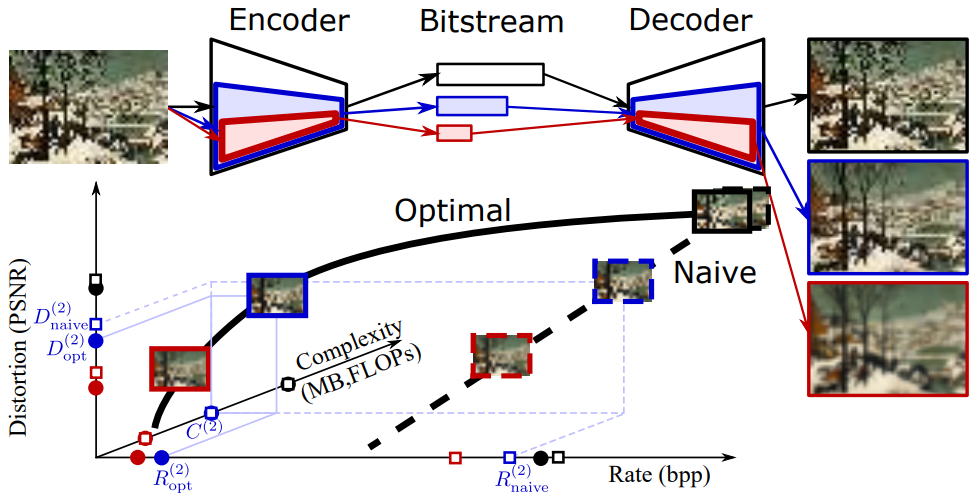

# Slimmable Compressive Autoencoders for Practical Neural Image Compression
### [[paper]](https://arxiv.org/abs/2103.15726)

PyTorch implementation of https://github.com/FireFYF/SlimCAE/tree/main

# Abstract: 
Neural image compression leverages deep neural networks to outperform traditional image codecs in rate-distortion performance. However, the resulting models are also heavy, computationally demanding and generally optimized for a single rate, limiting their practical use. Focusing on practical image compression, we propose slimmable compressive autoencoders (SlimCAEs), where rate (R) and distortion (D) are jointly optimized for different capacities. Once trained, encoders and decoders can be executed at different capacities, leading to different rates and complexities. We show that a successful implementation of SlimCAEs requires suitable capacity-specific RD tradeoffs. Our experiments show that SlimCAEs are highly flexible models that provide excellent rate-distortion performance, variable rate, and dynamic adjustment of memory, computational cost and latency, thus addressing the main requirements of practical image compression.
<br>
<p align="center"></p>

# Dependencies
This project relies on standard PyTorch and computer vision libraries.

- **PyTorch**
- **CompressAI**: For entropy models and GDN layers.
- **PyTorch MS-SSIM**: For the MS-SSIM metric.
- **NumPy**, **Matplotlib**, **Pillow**, **tqdm**

# Installation 
1.  Set up a Python virtual environment.
2.  Install all required packages in requirement.txt with pip:
    ```bash
    pip install -r requirements.txt
    ```

# Train a SlimCAE with a set of predefined RD tradeoffs for different widths
This is the main command for the initial Stage 1 training from scratch.
```bash
python SlimCAE_PyTorch.py train \
    --num_filters 192 \
    --switch_list 192 144 96 72 48 \
    --lmbda 2048 1024 512 256 128 \
    --train_glob '/path/to/training_dataset/' \
    --patchsize 128 \
    --last_step 1000000 \
    --checkpoint_dir '/path/of/the_pretrain_model_directory'
```

# Train a SlimCAE with lambda-scheduling
```bash
python SlimCAE_PyTorch.py train_lambda_schedule \
    --num_filters 192 \
    --switch_list 192 144 96 72 48 \
    --lmbda 2048 1024 512 256 128 \
    --checkpoint_dir '/path/of/the_pretrain_model_directory' \
    --train_glob '/path/to/training_dataset/' \
    --inputPath '/path/to/validation_dataset/' \
    --patchsize 128 \
    --batchsize 8
```

# Evaluate a pretrained model
## Option A: Evaluate a Single Model
To evaluate a single model:
```bash
python SlimCAE_PyTorch.py evaluate \
    --num_filters 192 \
    --switch_list 192 144 96 72 48 \
    --inputPath '/path/of/test_dataset/' \
    --checkpoint_paths '/path/of/the_pretrain_model.pth'\
    --report_path '/path/for/saving/results'
```

## Option B: Compare Two Models
To visualize the improvement from fine-tuning, you can compare the baseline model with the final model:
```bash
python SlimCAE_PyTorch.py evaluate \
    --num_filters 192 \
    --switch_list 192 144 96 72 48 \
    --inputPath '/path/of/test_dataset/' \
    --checkpoint_paths '/path/of/the_pretrain_model.pth' '/path/of/the_finetuned_model.pth'  \
    --report_path '/path/for/saving/results'
```


# Main references 
Our work heavily relys on the following projects: 
- \[1\] 'Lossy Image Compression with Compressive Autoencoders' by Theis et. al, https://arxiv.org/abs/1703.00395
- \[2\] 'Variable Rate Deep Image Compression With Modulated Autoencoder' by Fei et. al, https://ieeexplore.ieee.org/document/8977394
- \[3\] 'End-to-end Optimized Image Compression' by Ballé et. al, https://arxiv.org/abs/1611.01704
- \[4\] 'Variational image compression with a scale hyperprior' by Ballé et. al, https://arxiv.org/abs/1802.01436
 
It would be helpful to understand this project if you are familiar with the above projects.